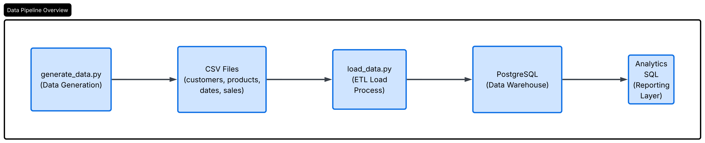
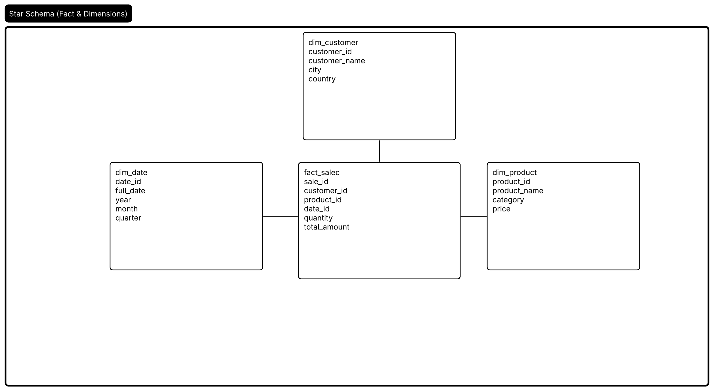

# E-commerce Data Warehouse

## Overview

End-to-end ETL pipeline built with Python, Pandas and PostgreSQL.

The project generates synthetic e-commerce data, loads it into a Star Schema data warehouse and performs analytical SQL reporting.

## Technologies

- Python
- Pandas
- PostgreSQL
- Docker
- SQL
- SQLAlchemy

## Architecture

ETL Pipeline:

Python → CSV → PostgreSQL → Analytics

## Data Model

Star Schema:

- fact_sales
- dim_customer
- dim_product
- dim_date

## Features

- Synthetic data generation
- Automated ETL process
- Data warehouse modeling
- Analytical SQL queries
- Revenue reporting
- Customer analytics

## Architecture

## Star Schema

